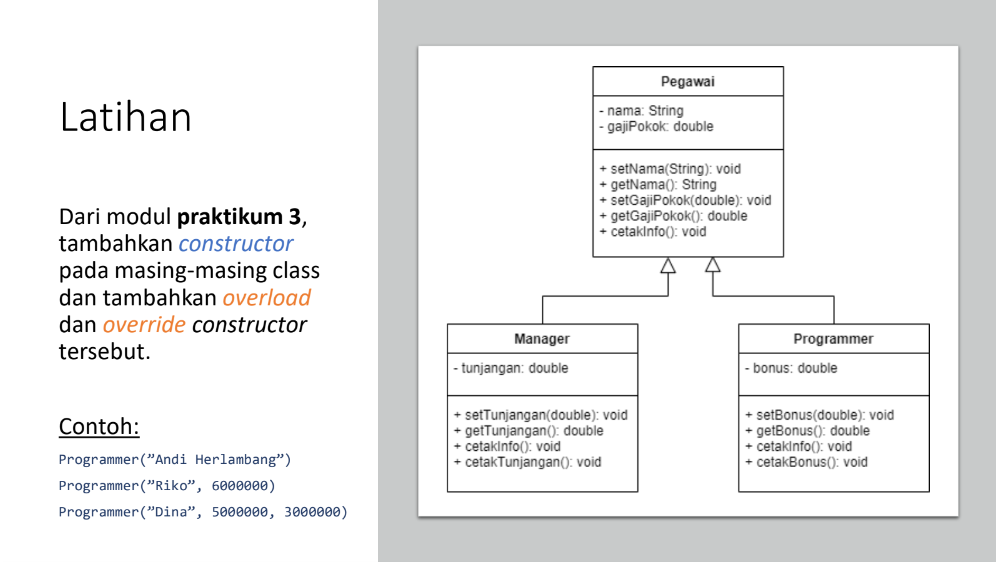
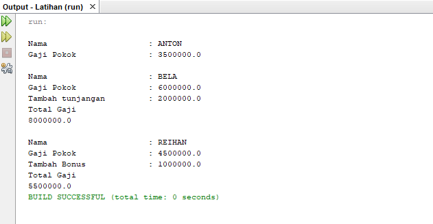

# Praktikum5
# Latihan-Tugas

<p><b> Nama    :   Afra Nesya Apriyanthi </p>
<p><b> NIM     :   312110614 </p>
<p><b> Kelas   :   TI.21.C1 </p>
<p><b> Mata Kuliah : Pemrograman Orientasi Objek</p>
<p><b> Tugas Pertemuan 9 </p>


<p> Berikut soal dari latihan  <p>



berikut script javanya
Pegawai.java

```java
public class Pegawai {
    private String name;
    private double gajipokok;
    // overload Constructor
    public Pegawai (String name, double gajipokok){
        this.name = name;
        this.gajipokok = gajipokok;
    }


    public String getName() {
        return name;
    }

    public double getGajipokok() {
        return gajipokok;
    }


    // Overriding
    public void display (){
        System.out.println("\nNama \t\t\t : " +getName());
        System.out.println("Gaji Pokok \t\t : " +getGajipokok());
    }
}
```

selanjutnya membuat java baru dengan nama Manager.java

```java
public class Manager extends Pegawai{
    private double tunjangan;

    public Manager (String name, double gajipokok) {
        super(name, gajipokok);
        this.tunjangan = 2000000;
    }

    public double getTunjangan() {
        return tunjangan;
    }

    @Override
    public void display() {
        super.display();
        System.out.println("Tambah tunjangan : " + this.tunjangan);
        System.out.println("Total Gaji");
        System.out.println(+getGajipokok()+getTunjangan());
    }
}
```

selanjutnya membuat java baru dengan nama Programmer.java

```java
public class Programmer extends Pegawai{
    private double bonus;

    public Programmer(String name, double gajipokok) {
        super(name, gajipokok);
        this.bonus = 1000000;
    }

    public double getBonus() {
        return bonus;
    }

    @Override
    public void display() {
        super.display();
        System.out.println("Tambah Bonus \t : "+ this.bonus);
        System.out.println("Total Gaji");
        System.out.println(+getGajipokok()+getBonus());
    }
}
```

dan terakhir membuat java baru dengan nama Main.java
```java
public class Main {
    public static void main(String[] args) {
        Pegawai pegawai1 = new Pegawai("ANTON", 3500000);
        Pegawai manager1 = new Manager("BELA", 6000000);
        Pegawai programmer = new Programmer("REIHAN", 4500000);
        pegawai1.display();
        manager1.display();
        programmer.display();
    }
}
```

<p> Maka hasil outputnya adalah<p>



